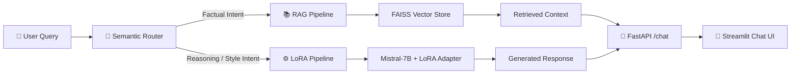

# 🧬 Hybrid LLM System: RAG + LoRA Fine-Tuning for Domain-Specific QA

> An intelligent dual-pipeline system that routes user queries to either a **Retrieval-Augmented Generation (RAG)** pipeline for factual lookups or a **LoRA fine-tuned language model** for reasoning and style tasks — powered by a lightweight semantic router.


---

## 🎯 Project Overview

Large Language Models are powerful, but no single inference strategy fits every query type:

| Query Type | Best Strategy | Why |
|---|---|---|
| *"What is our return policy?"* | **RAG** (retrieval) | Answer lives verbatim in company documents |
| *"Write a formal email about a delay"* | **LoRA fine-tuned model** | Requires stylistic reasoning, not document lookup |

This project builds **two specialized pipelines** with a **Semantic Router** in front:

1. **RAG Pipeline** — Ingests domain documents, chunks them, embeds them into a FAISS vector store, and retrieves the most relevant context at query time.
2. **LoRA Pipeline** — Loads a base LLM (Mistral-7B-Instruct) with a PEFT/LoRA adapter for domain-adapted reasoning and style generation.
3. **Semantic Router** — Embeds the incoming query, compares it against two intent clusters using cosine similarity, and dispatches to the best pipeline in under 5 ms.

---

## 🏗️ Architecture



```
User Query
    │
    ▼
┌─────────────────────────────────────┐
│         SEMANTIC ROUTER             │
│  ┌───────────┐   ┌───────────┐     │
│  │  Factual  │   │ Reasoning │     │
│  │  Cluster  │   │  Cluster  │     │
│  │(12 examples)  │(12 examples)    │
│  └─────┬─────┘   └─────┬─────┘    │
│        └───────┬────────┘          │
│          top-3 mean cosine sim     │
└────────────┬───────────────────────┘
             │
     ┌───────┴───────┐
     ▼               ▼
┌─────────┐   ┌───────────┐
│   RAG   │   │   LoRA    │
│ Pipeline│   │  Pipeline │
└────┬────┘   └─────┬─────┘
     └──────┬───────┘
            ▼
    ┌──────────────┐
    │ JSON Response │
    │ + routed_path │
    └──────────────┘
```

---

## 🚀 Key Features

- **Semantic Router** — Embedding-based intent classification using cosine similarity with top-3-mean scoring, confidence threshold fallback, and runtime-extensible example clusters.
- **RAG Pipeline** — RecursiveCharacterTextSplitter, FAISS vector store, HuggingFace embeddings (`all-MiniLM-L6-v2`), and runtime document ingestion via API.
- **LoRA Pipeline** — Lazy-loaded Mistral-7B with 4-bit NF4 quantization, production-ready adapter loading, and placeholder scaffold for prototyping.
- **Chat UI** — Streamlit interface with route badges, confidence score bars, quick-ingest sidebar, and force-route override for testing.

---

## 🛠️ Tech Stack

| Layer | Technology | Purpose |
|---|---|---|
| **Frontend** | Streamlit | Interactive chat interface |
| **Backend** | FastAPI + Uvicorn | REST API with async support |
| **Orchestration** | LangChain | Document loading, splitting, retrieval |
| **Vector Store** | FAISS | In-memory similarity search |
| **Embeddings** | `all-MiniLM-L6-v2` | Lightweight sentence embeddings (22M params) |
| **Base LLM** | Mistral-7B-Instruct | Instruction-tuned causal language model |
| **Fine-Tuning** | HuggingFace PEFT | LoRA adapter with configurable rank/alpha |
| **Quantization** | bitsandbytes | 4-bit NF4 for efficient GPU inference |

---

## 📂 Project Structure

```
project_root/
├── data/                      # Domain .txt documents
├── src/
│   ├── __init__.py
│   ├── rag_pipeline.py        # Document ingestion → chunking → FAISS retrieval
│   ├── lora_pipeline.py       # Base model + LoRA adapter loading & generation
│   ├── router.py              # Semantic router (cosine similarity)
│   └── main.py                # FastAPI app (/chat, /health, /ingest)
├── app.py                     # Streamlit chat frontend
├── requirements.txt
└── README.md
```

---

## 💻 Installation & Setup

### Prerequisites

- **Python 3.10+** and **pip**
- **(Optional)** NVIDIA GPU with ≥ 6 GB VRAM for LoRA pipeline

### Step 1 — Clone & Create Environment

```bash
git clone https://github.com/your-username/hybrid-rag-lora-system.git
cd hybrid-rag-lora-system

python -m venv venv
# Windows:  venv\Scripts\activate
# macOS/Linux:  source venv/bin/activate
```

### Step 2 — Install Dependencies

```bash
pip install -r requirements.txt
```

### Step 3 — (Optional) Add Domain Documents

```bash
echo "Our company was founded in 2020. We specialize in AI." > data/company_info.txt
```

---

## 🏃‍♂️ How to Run

You need **two terminals**:

### Terminal 1 — FastAPI Backend

```bash
uvicorn src.main:app --reload --host 0.0.0.0 --port 8000
```

Verify: `curl http://localhost:8000/health`

### Terminal 2 — Streamlit Frontend

```bash
streamlit run app.py
```

Opens at **http://localhost:8501**.

### Quick cURL Tests

```bash
# Factual → RAG
curl -X POST http://localhost:8000/chat \
  -H "Content-Type: application/json" \
  -d '{"query": "What is the return policy?"}'

# Reasoning → LoRA
curl -X POST http://localhost:8000/chat \
  -H "Content-Type: application/json" \
  -d '{"query": "Explain microservices vs monoliths trade-offs"}'
```

---

## ⚙️ Environment Variables

| Variable | Default | Description |
|---|---|---|
| `DATA_DIR` | `./data` | Auto-ingest directory |
| `PEFT_MODEL_PATH` | `None` | Trained LoRA adapter weights path |
| `BASE_MODEL_NAME` | `mistralai/Mistral-7B-Instruct-v0.1` | Base LLM model ID |

> **💡 Tip:** For CPU-only testing, set `BASE_MODEL_NAME=TinyLlama/TinyLlama-1.1B-Chat-v1.0`.

---

## 🔮 Future Improvements

- [ ] LLM-synthesized answers via LangChain `RetrievalQA`
- [ ] Multi-format ingestion (PDF, Markdown, HTML)
- [ ] Persistent vector store (ChromaDB)
- [ ] Fine-tuning script with `SFTTrainer`
- [ ] Evaluation suite (MRR, Recall@K, ROUGE, BERTScore)
- [ ] Docker Compose deployment

---

## 📄 License

Open-source under the [MIT License](LICENSE).

<div align="center">
  <sub>Built with ❤️ using FastAPI · LangChain · HuggingFace · Streamlit</sub>
</div>
